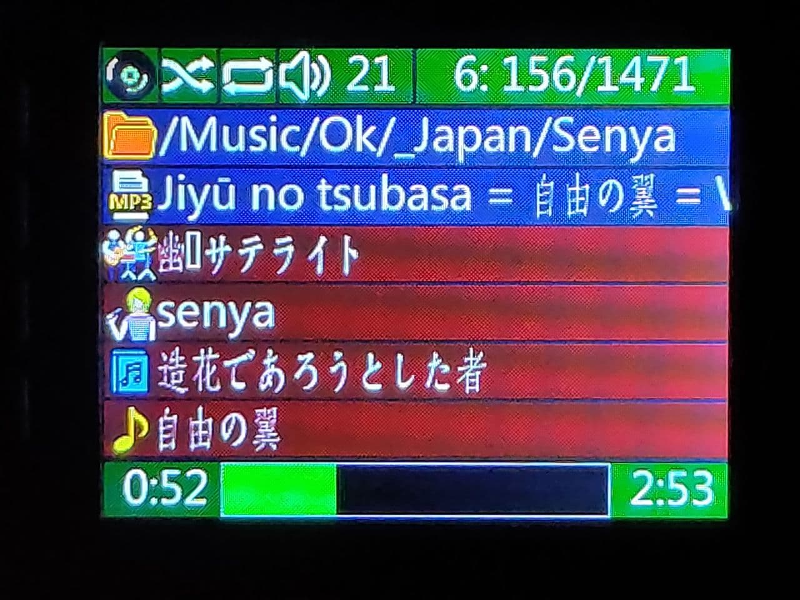

# Player
MicroSD mp3 player for my car

The player can play music files (tested mp3 and m4a only, flac doesn't work without PSRAM) 
from one of the user-defined favourite folders ("playlists") with all subfolders (up to predefined depth).
Each playlist stores it's current file and position, shuffle mode, volume.
It can be used for Music, Audiobooks, Language learning with quick switch between "playlists".

Controls:
- First encoder is used to change volume / jump to next/previous file (with stack of recently played files)
- Second encoder is used to seek within file, play/pause, navigate in playlist.

Display:
- Filesystem and font support Unicode.
- The font contains latin, greek, cyrillic, japanese (incomplete yet) characters.
- Info page is displaying current dir, file, mp3 tag info, play time on LCD
- Favourites page shows the list of user-defined favourite folders
- Playlist page is displaying current playlist, where any file can be choosen to play and any folder can be added to favourites.

work in progress...

## Hardware used

- TTGO-TM Music Albums:
    - ESP32
    - Flash upgraded to 16MB
    - no PSRAM
    - TFT LCD JLX320-00202-BN based on ST7789 320x200 fake IPS
    - microSD slot
    - I2S DAC PCM5102A
    - 3 user buttons + reset
- Two encoders with buttons:
    connected to two analog pins with 8 resistors
    
I didn't try to build the project for TTGO TM with original flash chip, not sure if it fit (the font uses too much flash space).

## Software/libraries used

- started from SDPlayer platform.io project: https://github.com/anp59/SDPlayer
    - SD_Libs from anp59
    - InputButton - no info (anp59?)
- https://github.com/schreibfaul1/ESP32-audioI2S
- https://github.com/greiman/SdFat-beta
- https://github.com/ImpulseAdventure/GUIslice
- https://github.com/Bodmer/TFT_eSPI
- https://github.com/Bodmer/TFT_eFEX
- https://github.com/Bodmer/JPEGDecoder
- AnalogEncoder from en-ot

The project builds with vscode + platform.io

## AnalogEncoder

My AnalogEncoder library is used to reduce pin count used to connect two encoders to ESP32.
Usually 3 pins are needed to connect each encoder, but with 4 resistors You can use only one pin with ADC input.
Unfortunatelly this needs very frequent reading from ADC (1 kHz or faster), so it can consume all CPU core.
(Without ADC_complete interrupt support and removed from library non-blocking ADC mode)
Fortunatelly ESP32 has "spare" cpu core, which can be used to process 2 ADC inputs.
